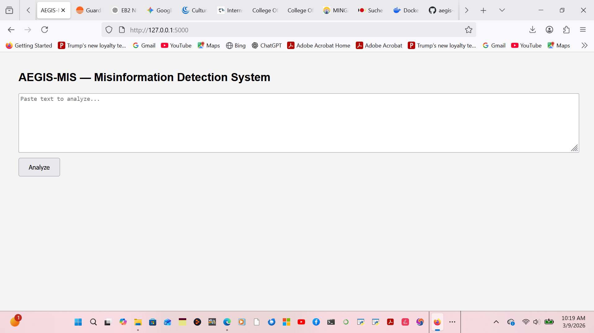
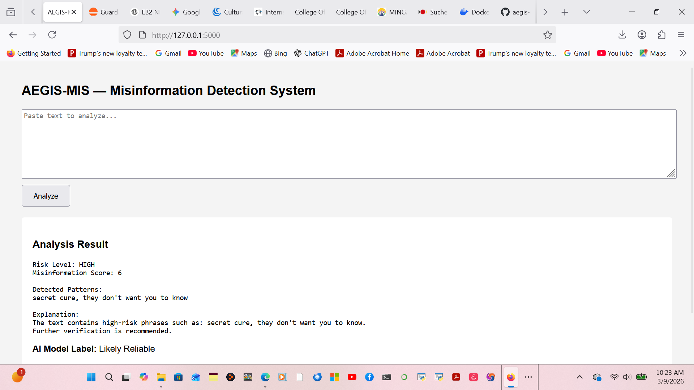

# AEGIS-MIS

**AEGIS-MIS (Automated Explainable Guard for Information Security – Misinformation Identification System)** is a hybrid AI-assisted misinformation detection platform designed to support information integrity, cybersecurity awareness, and public-interest defense.

## Features

- Rule-based misinformation trigger detection
- Machine learning NLP classifier
- Hybrid scoring logic
- Explainable analysis report
- Flask web interface
- REST API endpoint
- Analysis logging
- Model training pipeline
## Web Interface



## Example Analysis Result



## Project Structure

```text
AEGIS-MIS
├── data/
│   └── training_data.csv
├── models/
├── src/
│   ├── detector.py
│   ├── explainer.py
│   ├── ml_detector.py
│   └── main.py
├── app.py
├── train_model.py
├── requirements.txt
├── README.md
└── .gitignore
```

## Installation

```bash
python -m venv .venv
.venv\Scripts\activate
python -m pip install -r requirements.txt
```

## Train the Model

```bash
python train_model.py
```

## Run the Web App

```bash
python app.py
```

Then open:

```text
http://127.0.0.1:5000
```

## API Usage

Endpoint:

```text
POST /api/analyze
```

Example PowerShell request:

```powershell
Invoke-RestMethod `
-Uri "http://127.0.0.1:5000/api/analyze" `
-Method Post `
-ContentType "application/json" `
-Body '{"text":"This is a secret cure they do not want you to know."}'
```

## Current Evaluation

Using the current prototype dataset and a stratified train/test split, the baseline Logistic Regression + TF-IDF classifier achieved:

- Accuracy: 1.000
- Precision: 1.000
- Recall: 1.000
- F1 Score: 1.000

### Important Note

These results were obtained on a small synthetic prototype dataset and should be interpreted as an early validation signal rather than final real-world performance. Broader evaluation on larger and more diverse datasets is planned.

## Documentation

Additional project documentation:

- **Project Summary:** [project_summary.md](project_summary.md)
- **System Architecture:** [architecture.md](architecture.md)
- **Evaluation Results:** [evaluation_results.md](evaluation_results.md)

These documents describe the system design, experimental results, and overall project objectives for AEGIS-MIS.

## Purpose

AEGIS-MIS is a hybrid misinformation detection and security defense prototype that combines transparent rule-based logic with machine learning-assisted text classification.

## Status

Prototype under active development.