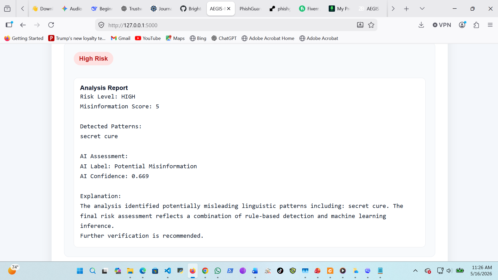

# AEGIS MIS
## Automated Explainable Guard for Information Security – Misinformation Identification System


AEGIS MIS (Automated Explainable Guard for Information Security – Misinformation Identification System) is a hybrid explainable misinformation detection system that combines rule based analysis with machine learning techniques to provide interpretable and lightweight misinformation analysis.

The system was developed to address the growing challenge of misinformation while maintaining transparency, explainability, and computational efficiency.

---

## Authors

- Bright Duffour
- Alberta Ayitey

---

## Live Demo

AEGIS MIS is publicly deployed below:

https://aegis-mis.onrender.com

---

## Demo Screenshot



---

## Example Input

```text
BREAKING: Scientists confirm the government is hiding a secret cure for cancer. Share this immediately before it gets removed.
```

---

## Example Output

```text
Risk Level: HIGH

AI Label: Potential Misinformation

Detected Pattern:
secret cure

AI Confidence: 0.669
```

---

## Overview

Misinformation spreads rapidly across digital platforms, making automated detection increasingly important. However, many machine learning systems operate as black box models that provide limited interpretability.

AEGIS MIS addresses this challenge through a hybrid architecture that combines:

- Rule based analysis for interpretability
- Machine learning classification using TF IDF and Logistic Regression
- Explainability mechanisms for transparent decision support

The system provides a lightweight and explainable approach for analyzing suspicious or misleading textual content.

---

## Key Features

- Hybrid misinformation detection
- Rule based linguistic pattern analysis
- TF IDF feature extraction
- Logistic Regression classification
- Explainable decision support
- Lightweight architecture
- Flask web interface
- REST API support
- Real time text analysis

---

## Abstract

AEGIS MIS is a hybrid misinformation detection prototype designed to identify potentially deceptive, manipulative, or misleading textual content.

The system integrates rule based pattern detection with a machine learning classifier based on TF IDF feature extraction and Logistic Regression. These components are combined through a hybrid scoring engine that produces an interpretable misinformation risk assessment.

To support transparency and trustworthiness, AEGIS MIS includes an explainability module that highlights the triggers and model signals contributing to each classification decision.

The framework is deployed through a lightweight Flask web application and REST API, enabling interactive analysis and integration with other security focused systems.

---

## How It Works

The system processes text using two complementary detection approaches.

### 1. Rule Based Analysis

The rule based engine analyzes:

- Suspicious keywords
- Misleading linguistic patterns
- Sensational expressions
- Manipulative phrases
- Trigger based indicators

Each detected pattern contributes to a cumulative misinformation risk score.

---

### 2. Machine Learning Classification

The machine learning pipeline:

- Converts text into TF IDF feature vectors
- Applies Logistic Regression classification
- Generates probability based predictions
- Produces confidence scores

---

### Final Decision Layer

The outputs from both components are combined to produce:

- Final misinformation risk level
- AI classification label
- Confidence score
- Explainable reasoning output

---

## System Architecture

The AEGIS MIS framework consists of the following components:

- Input preprocessing module
- Rule based analysis engine
- TF IDF feature extraction layer
- Machine learning classification engine
- Hybrid scoring layer
- Explainability engine
- Flask web interface
- REST API layer

---

## Dataset

AEGIS MIS uses two categories of datasets:

1. Synthetic prototype validation dataset
2. Benchmark evaluation dataset derived from the publicly available LIAR dataset

The synthetic dataset was used to validate the hybrid explainable architecture in a controlled experimental environment.

The benchmark evaluation dataset was derived from the LIAR dataset for misinformation classification experiments.

Dataset source:

https://www.cs.ucsb.edu/~william/data/liar_dataset.zip

The preprocessing pipeline included:

- Text normalization
- Lowercasing
- Label simplification
- TF IDF feature extraction

The processed data was used to train the lightweight Logistic Regression misinformation classifier integrated into the AEGIS MIS framework.

The machine learning pipeline generated serialized model artifacts used during real time inference and deployment.

---

## Web Interface


---

## Example Analysis Result


---

## Reproducibility

The repository includes:

- Source code
- Training scripts
- Serialized machine learning models
- Deployment configuration files
- Example screenshots
- Requirements file for dependency installation

The project can be reproduced locally using the installation instructions provided below.

---

## Installation

Clone the repository:

```bash
git clone https://github.com/Brightd4/aegis-mis.git
cd aegis-mis
```

Create and activate a virtual environment:

```bash
python -m venv .venv
```

Activate on Windows:

```bash
.venv\Scripts\activate
```

Install dependencies:

```bash
pip install -r requirements.txt
```

Run the application:

```bash
python app.py
```

The application will run locally at:

```text
http://127.0.0.1:5000
```

---

## Project Structure

```text
AEGIS-MIS
├── data/
├── docs/
├── exhibits/
├── figures/
├── models/
├── screenshots/
├── src/
│   ├── detector.py
│   ├── explainer.py
│   ├── ml_detector.py
│   └── main.py
├── app.py
├── train_model.py
├── requirements.txt
├── Procfile
├── README.md
└── .gitignore
```

---

## Limitations

AEGIS MIS is a lightweight research prototype and has several limitations.

- The rule based engine depends on manually defined patterns
- The benchmark evaluation was conducted on a limited misinformation dataset
- The system currently focuses primarily on English language text
- The model may produce false positives or false negatives
- The synthetic validation dataset does not fully represent real world misinformation complexity

The framework is intended for research and educational purposes rather than production level misinformation moderation.

---

## Ethical Considerations

AEGIS MIS was designed to support explainable misinformation analysis while maintaining transparency in decision making.

The system does not make authoritative truth judgments and should not be used as the sole basis for censorship, content removal, or legal decisions.

Human verification and contextual interpretation remain essential when evaluating potentially misleading information.

---

## Future Work

Potential future improvements include:

- Deep learning based misinformation detection
- Transformer based architectures
- Multilingual misinformation analysis
- Real time social media monitoring
- Adversarial robustness evaluation
- Expanded benchmark testing
- Explainable AI visualization improvements

---
## DOI

The archived AEGIS MIS software release is available on Zenodo:

https://doi.org/10.5281/zenodo.20161662

---

## Citation

If you use AEGIS MIS in research or academic work, please cite:

```text
Duffour, B., & Ayitey, A. (2026). AEGIS MIS: A Hybrid Explainable Misinformation Detection System Using Rule Based Analysis and Machine Learning.
```

---

## License

This project is released under the MIT License.
