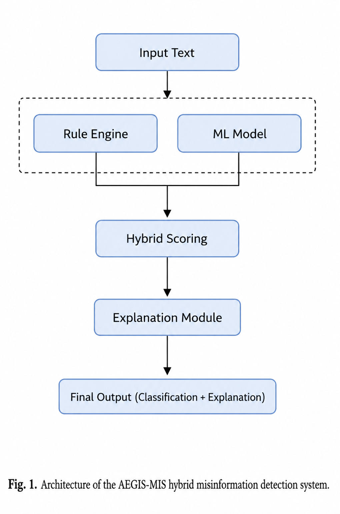
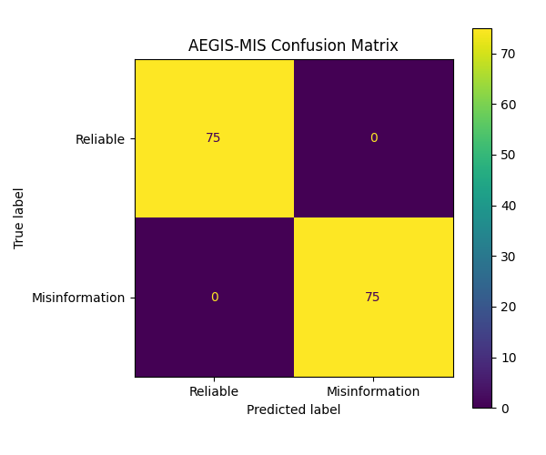

# A Hybrid Explainable Misinformation Detection Framework Using Rule Based Analysis and Machine Learning

## Authors

Bright Duffour  
Alberta Ayitey

---

# Abstract

Misinformation continues to pose significant challenges to information integrity, digital trust, and online security. Existing misinformation detection systems often rely heavily on black box machine learning models that provide limited interpretability for end users and analysts.

This paper presents AEGIS MIS, an Automated Explainable Guard for Information Security – Misinformation Identification System, designed as a lightweight hybrid explainable misinformation detection framework. The system combines rule based linguistic analysis with TF IDF feature extraction and Logistic Regression classification to improve interpretability while maintaining computational simplicity.

The framework includes an explainability module capable of identifying suspicious linguistic patterns, risk indicators, and AI confidence signals contributing to misinformation classification decisions. Experimental evaluation was performed using both synthetic prototype validation data and a benchmark dataset derived from the LIAR dataset. Benchmark evaluation produced moderate performance results, with model accuracy ranging from 0.61 to 0.62 and F1 scores ranging from 0.61 to 0.64 across multiple classifier configurations.

The results demonstrate the feasibility of lightweight explainable misinformation detection approaches while highlighting the challenges associated with real world misinformation classification. AEGIS MIS is intended as a research prototype for educational, academic, and experimental cybersecurity research applications.

---

# Introduction

The rapid spread of misinformation across digital platforms has created significant societal, political, and cybersecurity concerns. False or misleading information can influence public opinion, undermine institutional trust, and contribute to harmful real world consequences. Social media platforms and online communication systems have accelerated the speed and scale at which misinformation can propagate.

Recent advances in artificial intelligence and natural language processing have improved automated misinformation detection capabilities. However, many existing systems rely on complex black box architectures that provide limited transparency regarding how classification decisions are made. This lack of interpretability creates challenges for trust, accountability, and human verification.

AEGIS MIS was developed to explore hybrid explainable approaches that combine interpretable rule based reasoning with lightweight machine learning classification techniques. The framework prioritizes transparency, modularity, reproducibility, and computational efficiency while maintaining practical misinformation detection functionality.

The primary contributions of this work include:

- Development of a lightweight hybrid misinformation detection framework
- Integration of explainable rule based analysis with machine learning classification
- Benchmark evaluation using misinformation related datasets
- Deployment of an interactive Flask based misinformation analysis system
- Emphasis on interpretability and transparency in misinformation detection workflows

---

# Related Work

Misinformation detection has become an important research area within natural language processing, cybersecurity, and information integrity. Early approaches to misinformation and fake news detection commonly relied on traditional machine learning methods such as Logistic Regression, Support Vector Machines, Naive Bayes, and feature engineering methods based on term frequency and inverse document frequency. These approaches remain useful in lightweight systems because they are computationally efficient and easier to interpret than many large deep learning models.

A widely used benchmark in misinformation research is the LIAR dataset, introduced by Wang. The LIAR dataset contains short political statements labeled according to truthfulness categories and has been widely used for evaluating fake news and misinformation classification models. Although the dataset is challenging because of the short and context dependent nature of the statements, it remains useful for benchmarking text based misinformation detection systems.

More recent work has explored deep learning and transformer based models for fake news detection. FakeBERT, proposed by Kaliyar and colleagues, combines BERT based language representation with deep learning layers for fake news detection in social media contexts. Transformer based models often improve semantic representation, but they can require more computational resources and may provide limited interpretability compared with simpler models.

Explainable Artificial Intelligence has also become increasingly important in security sensitive AI systems. Adadi and Berrada provided a broad survey of explainable AI and emphasized the need to make black box systems more transparent and understandable. In misinformation detection, explainability is especially important because users and analysts need to understand why a statement is classified as suspicious or misleading.

Recent studies and surveys continue to show that fake news detection remains a difficult problem because misinformation is context dependent, linguistically diverse, and often designed to exploit emotional or social biases. Reviews of machine learning and deep learning approaches show that while complex models may improve performance, challenges remain in interpretability, dataset bias, generalization, and real world deployment.

AEGIS MIS builds on this body of work by focusing on a lightweight hybrid architecture that combines rule based analysis with TF IDF feature extraction and Logistic Regression classification. Rather than claiming to replace large scale misinformation detection systems, AEGIS MIS is positioned as an explainable research prototype that emphasizes transparency, reproducibility, and practical deployment simplicity.

---

# Methodology

## System Overview

AEGIS MIS was designed as a modular misinformation detection framework consisting of several interconnected components. These include a Flask based web interface, a rule based detection engine, a machine learning classification engine, a hybrid scoring module, an explainability engine, and a REST API endpoint.

The framework processes user supplied text through two complementary analysis pipelines. The rule based component identifies suspicious linguistic patterns and manipulative trigger phrases, while the machine learning component evaluates the statistical characteristics of the text using TF IDF vectorization and Logistic Regression classification.

The outputs from both components are merged through a hybrid scoring mechanism to produce a final misinformation assessment accompanied by explainable reasoning output.

---

## Rule Based Detection

The rule based detector identifies predefined linguistic indicators associated with misinformation narratives. Examples include phrases related to conspiracy framing, urgency, hidden truths, suppression narratives, and exaggerated sensational language.

Each detected trigger contributes weighted scores to the final misinformation assessment. The system also stores the matched trigger phrases for later use by the explainability module.

---

## Machine Learning Classification

The machine learning component uses TF IDF feature extraction and Logistic Regression classification implemented using scikit learn.

Input text is transformed into sparse numerical vectors using TF IDF representation before being passed into the classifier. The classifier returns both a predicted label and a probability based confidence score used during hybrid scoring.

---

## Hybrid Scoring

The hybrid scoring layer combines outputs from the rule based and machine learning components. This approach allows explicit linguistic reasoning and statistical inference to reinforce one another while preserving transparency.

The combined output generates:

- Risk classification
- Confidence score
- Trigger phrase identification
- Human readable explanation

---

# System Architecture

The AEGIS MIS architecture follows a dual path misinformation analysis pipeline.

The framework consists of:

- Input preprocessing module
- Rule based analysis engine
- TF IDF feature extraction module
- Logistic Regression classification engine
- Hybrid scoring layer
- Explainability module
- Flask web application
- REST API interface

Figure 1 illustrates the overall architecture of the framework.

---

# Experimental Evaluation

## Dataset Construction

Evaluation was performed using two datasets:

1. A controlled synthetic misinformation dataset
2. A benchmark dataset derived from the publicly available LIAR dataset

The synthetic dataset was used to validate the explainability workflow and overall feasibility of the hybrid architecture.

The benchmark evaluation dataset was derived from the LIAR dataset by converting the original multi class labels into a binary misinformation classification setting.

---

## Preprocessing

The preprocessing pipeline included:

- Text normalization
- Lowercasing
- Label simplification
- TF IDF feature extraction

The processed data was divided into training and testing splits using stratified sampling.

---

## Evaluation Metrics

Performance evaluation used standard classification metrics including:

- Accuracy
- Precision
- Recall
- F1 Score

These metrics were selected to provide a balanced assessment of misinformation detection performance under benchmark conditions.

---

# Results and Discussion

The synthetic prototype dataset produced strong classification performance during early validation experiments. However, because the synthetic dataset was highly controlled, these results should be interpreted cautiously.

Benchmark evaluation on the LIAR derived dataset produced more realistic moderate performance results.

Table 1 summarizes benchmark evaluation performance across multiple lightweight classifiers.

| Model | Accuracy | F1 Score |
|---|---:|---:|
| Logistic Regression | 0.61 | 0.61 |
| Improved Logistic Regression | 0.62 | 0.62 |
| Linear SVM | 0.61 | 0.64 |
| Feature Union SVM | 0.62 | 0.62 |

Figure 2 presents the benchmark model comparison.

Figure 3 presents the confusion matrix generated during benchmark evaluation.

The benchmark results demonstrate that misinformation detection remains a difficult classification problem because of contextual ambiguity and linguistic variability. Although the lightweight models achieved only moderate performance, the explainability and deployment features of AEGIS MIS remain significant practical contributions.

The explainability module successfully highlighted suspicious trigger phrases, AI confidence scores, and reasoning signals contributing to each classification decision. This improves transparency compared with purely black box misinformation detection systems.

The results also demonstrate that lightweight hybrid architectures can provide interpretable and deployable misinformation analysis without requiring computationally expensive transformer based models.

---

# Limitations

This study has several limitations.

- The synthetic validation dataset does not fully represent real world misinformation complexity
- The benchmark dataset focuses primarily on short political statements
- The system currently focuses on English language text
- The rule based component requires manual maintenance
- The lightweight classifiers remain limited in semantic understanding compared with transformer based approaches

AEGIS MIS is intended as a lightweight explainable research prototype rather than a production level misinformation moderation system.

---

# Ethical Considerations

AEGIS MIS was developed to support explainable misinformation analysis while preserving transparency in automated decision making.

The system does not make authoritative truth judgments and should not be used as the sole basis for censorship, content removal, or legal action.

Human verification and contextual interpretation remain essential when evaluating potentially misleading information.

The framework is intended for research, educational, and experimental cybersecurity applications.

---

# Conclusion

This paper presented AEGIS MIS, a lightweight hybrid explainable misinformation detection framework integrating rule based analysis with machine learning classification.

The system demonstrated the feasibility of combining interpretable linguistic reasoning with TF IDF based statistical classification within a deployable web application framework.

Benchmark evaluation produced moderate but realistic performance results, highlighting both the challenges of misinformation detection and the practicality of lightweight explainable approaches.

The primary contribution of AEGIS MIS lies not in claiming state of the art predictive accuracy, but in demonstrating how explainability, transparency, reproducibility, and deployment readiness can be integrated into misinformation detection workflows.

Future work will explore:

- Transformer based misinformation detection
- Multilingual support
- Adversarial robustness testing
- Expanded benchmark evaluation
- Real time social media misinformation analysis
- Enhanced explainability visualization

---

# References

1. Shu K, Sliva A, Wang S, Tang J, Liu H. Fake news detection on social media: A data mining perspective. SIGKDD Explorations. 2017;19(1):22–36.

2. Sharma K, Qian F, Jiang H, Ruchansky N, Zhang M, Liu Y. Combating fake news: A survey on identification and mitigation techniques. ACM Transactions on Intelligent Systems and Technology. 2019;10(3):1–42.

3. Devlin J, Chang MW, Lee K, Toutanova K. BERT: Pre training of deep bidirectional transformers for language understanding. Proceedings of NAACL HLT. 2019:4171–4186.

4. Pedregosa F, et al. Scikit learn: Machine learning in Python. Journal of Machine Learning Research. 2011;12:2825–2830.

5. Ribeiro MT, Singh S, Guestrin C. Why should I trust you?: Explaining the predictions of any classifier. Proceedings of the ACM SIGKDD Conference on Knowledge Discovery and Data Mining. 2016:1135–1144.

6. Vaswani A, et al. Attention is all you need. Advances in Neural Information Processing Systems. 2017;30:5998–6008.

7. Wang WY. Liar, liar pants on fire: A new benchmark dataset for fake news detection. Proceedings of the Annual Meeting of the Association for Computational Linguistics. 2017:422–426.

8. Kaliyar RK, Goswami A, Narang P. FakeBERT: Fake news detection in social media with a BERT based deep learning approach. Multimedia Tools and Applications. 2021;80(8):11765–11788.
