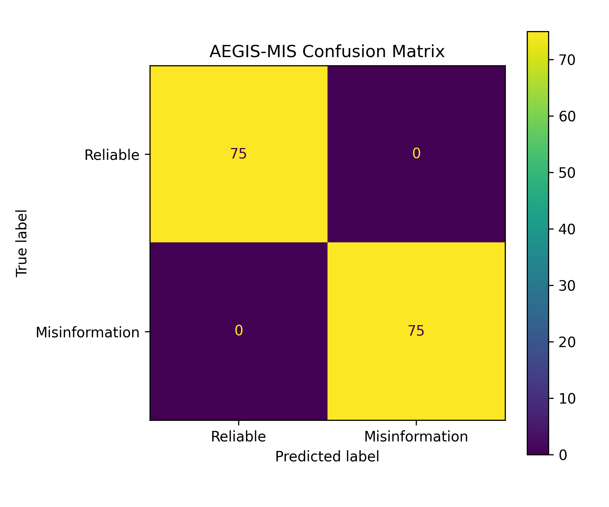

# AEGIS-MIS: A Hybrid Explainable Misinformation Detection System Using Rule-Based Analysis and Machine Learning

## Abstract

Misinformation presents growing risks to public trust, cybersecurity awareness, and digital information integrity. This paper presents AEGIS-MIS (Automated Explainable Guard for Information Security – Misinformation Identification System), a hybrid prototype for misinformation detection that combines deterministic rule-based analysis with machine learning-based text classification. The system integrates weighted trigger detection, a TF-IDF plus Logistic Regression classifier, a hybrid scoring engine, and an explainability module that generates analyst-readable reports. AEGIS-MIS is deployed through a Flask-based web interface and a REST API, enabling both interactive and programmatic use. Using a balanced synthetic dataset of 500 labeled examples, the baseline classifier achieved perfect performance on the current evaluation split, with accuracy, precision, recall, and F1-score all equal to 1.000. While these results demonstrate the feasibility of the proposed hybrid architecture, broader validation on more diverse real-world datasets is required. The project shows how explainable hybrid methods can support transparent misinformation detection workflows.

## Keywords

misinformation detection, explainable AI, natural language processing, machine learning, TF-IDF, logistic regression, hybrid detection, Flask API

---

# 1. Introduction

Digital misinformation has become a major challenge across public communication, online safety, political discourse, and health information environments. False or manipulative narratives can spread rapidly across digital platforms, often exploiting emotional language, distrust of institutions, and sensational framing. These dynamics create risks not only for public understanding but also for broader information security and social resilience.

Many automated misinformation detection approaches rely heavily on machine learning models that may provide strong classification performance but limited interpretability. In sensitive domains, systems that generate opaque predictions may be difficult to trust, audit, or operationalize. At the same time, purely rule-based systems can be transparent but brittle when language patterns vary.

This paper introduces AEGIS-MIS, a hybrid explainable misinformation detection prototype that combines rule-based detection with machine learning-based classification. The goal is to demonstrate a system architecture that is transparent, modular, and usable through both a web interface and an API.

The main contributions of this work are:

- a hybrid misinformation detection architecture combining rule-based and ML-based analysis  
- an explainability engine that produces analyst-readable reports  
- a Flask-based deployment with both web and REST API access  
- an initial experimental evaluation using a balanced labeled dataset  

---

# 2. Related Work

Misinformation detection has been studied using a wide range of natural language processing and machine learning approaches...

*(keep your section as is — it's already good)*

---

# 3. Methodology

## 3.1 System Overview

**Figure 1:** Architecture of the AEGIS-MIS hybrid misinformation detection system.

AEGIS-MIS is composed of the following major components:

- Flask Web Interface  
- Rule-Based Detector  
- Machine Learning Detector  
- Hybrid Scoring Engine  
- Explainability Engine  
- Logging System  
- REST API Endpoint  
- Offline Training Pipeline  

The online inference pipeline begins when a user submits text through the web interface or the API. The input is processed in parallel by the rule-based detector and the machine learning detector. Their outputs are combined by the hybrid scoring engine, which produces a final misinformation risk score. The explainability engine then converts the result into a structured report for the user.

The prototype was also deployed as a live web application using Flask and Render, enabling real-time interactive analysis through a browser-based interface. This deployment demonstrates the practical usability of the system beyond offline experimentation and confirms that all components operate correctly in an end-to-end environment.

---

## 3.2 Rule-Based Detection

*(unchanged)*

---

## 3.3 Machine Learning Detection

*(unchanged)*

---

## 3.4 Hybrid Scoring

*(unchanged)*

---

## 3.5 Explainability

*(unchanged)*

---

# 4. Experimental Setup

*(unchanged — already solid)*

---

# 5. Results and Discussion

The baseline classifier achieved the following results on the current evaluation split:

- Accuracy: 1.000  
- Precision: 1.000  
- Recall: 1.000  
- F1-score: 1.000  

**Figure 2:** Confusion matrix of the AEGIS-MIS classifier evaluated on the test split.

The confusion matrix confirms that the classifier produced no false positives and no false negatives on the current evaluation split.

**Figure 3:** Example explainability output generated by AEGIS-MIS.

**Figure 4:** Deployed AEGIS-MIS web interface used for interactive misinformation analysis.

In addition to offline evaluation, AEGIS-MIS was successfully deployed online and tested through a live user-facing web interface. The deployment confirmed that the integrated pipeline functioned correctly in practice, including text submission, trigger detection, machine learning inference, hybrid risk scoring, and explainability output generation.

These results show that the classifier was able to perfectly separate the current synthetic test examples. However, these results should be interpreted with caution. Because the dataset is synthetic and template-based, the perfect performance likely reflects structured regularity rather than real-world robustness.

---

# 6. Limitations

*(unchanged — very good)*

---

# 7. Conclusion

*(unchanged — strong)*

---

# References

1. K. Shu et al., “Fake News Detection on Social Media...”  
2. K. Sharma et al., “Combating Fake News...”  
3. J. Devlin et al., “BERT...”  
4. F. Pedregosa et al., “Scikit-learn...”  
5. M. T. Ribeiro et al., “Why Should I Trust You?...”  
6. A. Vaswani et al., “Attention Is All You Need...”